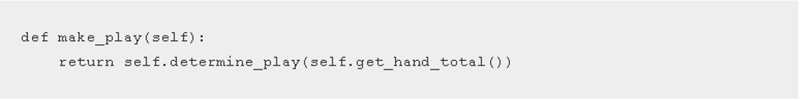

# Tutorial de Behave para el “juego 21” o BlackJack

## Participantes
Luis Daniel Hormiga González 20172020026  
Javier Andrés Aponte Quevedo 20172020036  
Julian David Rincon Castro 20172020125  

## Introducción

La evaluación de comportamiento significa que debemos examinar cómo se comporta una aplicación a la hora de ejecutar una orden, la manera en que se ejecutan los algoritmos y el resultado de cada acción. Esto describe la funcionalidad de la aplicación y nosotros escribimos código que cumple con estas especificaciones.

## Enfocando la evaluación de comportamiento con Behave en el juego 21
El primer paso será establecer el entorno donde se escribirán las evaluaciones de comportamiento. Específicamente, vamos a estar evaluando el comportamiento del repartidor de las cartas. Para empezar, crearemos una carpeta raíz o “root folder” donde irá el código, generando así directorios en blanco.
**Nota:** Para estas evaluaciones los nombres serán en inglés para mayor facilidad del código.

Explicación de los archivos y directorios creados:
- dealer.feature: Contiene las evaluaciones escritas con las funciones del repartidor.
- steps.py: Este código corre las evaluaciones descritas del dealer.feature
- twentyone.py: Implementa el código de las funciones del repartidor.

## Escribiendo la primera evaluación

Aunque se puede empezar directamente a realizar evaluaciones por código, es recomendable crear antes unas declaraciones escritas de texto para crear el escenario del “juego 21”

## Escribiendo el escenario

Paso 1: En el archivo dealer.feature vamos a añadir la siguiente línea: 

Esta línea hace referencia al repartidor. 
Paso 2: Añadiremos una función del repartidor, al iniciar la partida el repartidor deberá dar 2 cartas a cada jugador, lo que se resume en la siguiente línea:

Antes de continuar debemos entender las tres fases de una evaluación con Behave: “Given”, “When” y “Then”. 

- Given inicializa el estado.
- When describe una acción.
- Then establece la salida esperada. 

Para esta evaluación, nuestro estado es un objeto repartidor, la acción es comenzar la ronda y la salida esperada es que cada jugador tenga dos cartas, esto traducido en Behave es lo siguiente:

Sugerencia: Nótese que las tres fases están escritas de forma concisa, se recomienda hacer esto para que cada persona que vaya a continuar o modificar el código lo pueda entender fácilmente.
Paso 3: Para comprobar cómo trabaja Behave, simplemente abrimos la terminal en el directorio raíz de nuestro código y ponemos el siguiente comando:

El resultado debe mostrar lo siguiente:

Como se puede observar, un escenario ha fallado, significa que una característica falló y debemos repararla, de esta manera, Behave sugiere una forma de solucionar la falla. Pensaremos en una serie de pasos para que Behave los ejecute.

## Escribiendo los pasos

Los pasos que corre Behave están escritos en Python y están enlazados entre los archivos de la evaluación descriptiva .feature y la aplicación de código.
Abriremos steps.py y añadimos las siguientes líneas:

Los pasos escritos en Behave deben llamarse igual que los nombres de las fases, si estos no coinciden entonces la evaluación no va a correr. El primer paso como fue descrito en el escenario iría de la siguiente forma:

El objeto de contexto (El repartidor o Dealer), va paso por paso guardando la información de los pasos anteriores, mientras que este paso sea un “Given”, deberemos inicializar nuestro estado. Podemos hacer esto creando el objeto Dealer y enlazando este objeto con el context. Si ejecutamos Behave nuevamente veremos que la evaluación fallará, pero en esta ocasión es porque no hemos definido la clase Dealer, entonces tenemos una evaluación que nos encamina a realizar más trabajos.
Ahora abriremos twentyone.py y crearemos la clase Dealer:

Ejecutamos Behave nuevamente para verificar si hemos solucionado el último error y que el escenario sigue fallando porque los pasos “when” y “then” aún no se han establecido.
Debemos tener en cuenta ejecutar Behave siempre que lo veamos necesario. Aclarado esto, los siguientes pasos que añadiremos a steps.py serán:

Nuevamente, comprobamos que la anotación coincide exactamente con el texto del escenario, en el paso “when” tenemos acceso al repartidor, es decir el dealer y comprobamos que hay dos cartas en mano.
Ahora definimos dos líneas nuevas de código:

La función _next_card() será definida como una función de alta prioridad del módulo, además de una definición de las cartas. Al principio del archivo añadimos esto:

Nota: Recuerda que random no es una forma segura de repartir las cartas, pero por efectos de simplicidad se utiliza en este tutorial.
Si ejecutamos behave en este momento veremos lo siguiente:

## Escribiendo evaluaciones a manera de tabla

Con frecuencia al escribir evaluaciones queremos ver su comportamiento contra muchos parámetros y resultados. Behave permite hacer esto de manera sencilla dando herramientas para crear tablas, aquí una evaluación que permite ver varios escenarios:

Se permite reconocer el patrón “given, when, then” pero hay varias diferencias en esta evaluación, el primero se llama “Scenario Outline” que hace referencia al escenario que estamos evaluando, dándonos también una salida con “hand” (entrada) y “total” (salida).
Ahora implementamos el siguiente paso “given”

Justo como antes, creamos un objeto Dealer pero esta vez de manera manual establecemos las cartas del repartidor y dividimos el parámetro “hand” para obtener una lista como la que vemos a continuación: 

## Unificando el código 
Vamos a poner todo el proceso de resultados que se obtienen en el código escrito:

## Resultado

## Conclusión

Este tutorial ha mostrado el proceso para crear un proyecto con behave orientado al “juego 21” o también llamado BlackJack y cómo utilizar los procesos enfocados a pasos para evaluar el comportamiento de la aplicación y el algoritmo.

